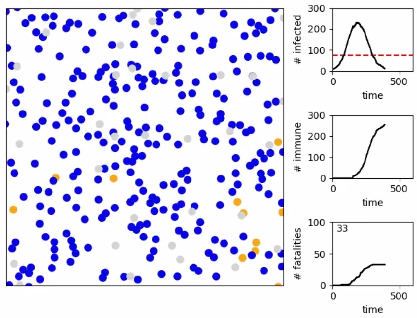

# Projects
I spend most of my free time away from the computer, but at times I have a quiet evening at home and do some thinking / coding / experimenting. In that order. The result of that are small projects I'm sharing here.

## Agent-based simulation of an epidemic
Like many of us I became a couch epidemiologist during the ongoing Covid-19 crisis, but channeled that mostly into whipping up a little Python library which lets you simulate an epidemic.  
The basic idea is that a populations of persons move around in a rectangular geometry.
If two persons are sufficiently close to each other, the disease can be transmitted.
The details are specified in classes for particle engines (which are responsible for simulation of the movement of the persons), disease and disease transmission, health systems (to simulate, e.g., ICU capacity limits) etc. and are thus customizable.  
This current implementation allows to visualize now well-known terms such as exponential growth and "flattening the curve" and allows to simulate different degrees of compliance with barrier measures.  
Here's a screenshot, where blue dots are healthy persons, orange dots infected persons and gray dots persons who died:  
  
If you feel like playing around with, clone the [GitHub repository](https://github.com/simeoncarstens/pandemic-sim).
Issues and PRs are welcome!